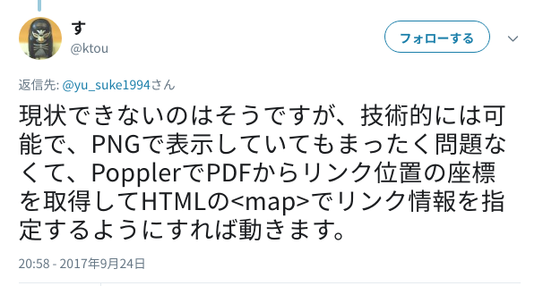
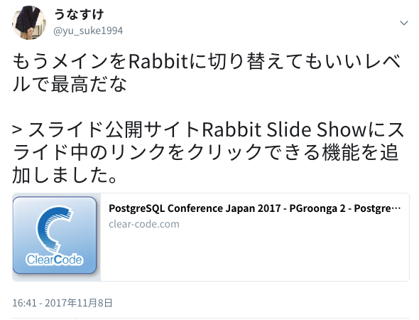
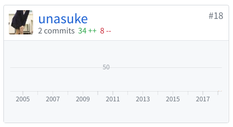

# 僕のスライドツール変遷
subtitle
: 2018-09-15 浅草 雷5656会館 5F・6F『ときわホール』

subtitle
: 大江戸Ruby会議07

author
: うなすけ

theme
: unasuke-white

# 自己紹介
- 名前 : うなすけ
- 所属 : 株式会社バンク (エンジニア)
  - インフラ寄りサーバーサイドエンジニア
  - 業界4年目

- GitHub [@unasuke](https://github.com/unasuke)
- {::tag name="x-small"}Mastodon [@unasuke@mstdn.unasuke.com](https://mstdn.unasuke.com/@unasuke){:/tag}
- Twitter [@yu\_suke1994](https://twitter.com/yu_suke1994)

{:relative_width="24" align="right" relative_margin_right="-10" relative_margin_top="42"}

# ちょっと宣伝
{:relative_width="100"}

# ちょっと宣伝
{:relative_width="100"}

# ちょっと宣伝
{:relative_width="60"}

# 今日話すこと

[https://twitter.com/yu_suke1994/status/1018866369561915394](https://twitter.com/yu_suke1994/status/1018866369561915394)

# もくじ
1. 生活発表会
1. これまでのスライド作成
1. スライドに求めるもの

# 生活発表会
>
地域Rubyist集団Asakusa.rbがmeetupのだいたい100回を記念して、うららかな春の昼下がりの東京下町で地域Ruby会議を開催します。地域Rubyist集団の生活発表会みたいなものです。

[http://regional.rubykaigi.org/oedo01/](http://regional.rubykaigi.org/oedo01/)

{:.center}
{::tag name="x-large"}大江戸Ruby会議 = 生活発表会{:/tag}

# Rubyistの生活
- Rubyを書く
- Ruby会議に行く
- なにかしら登壇する

{:.center}
Rubyistの生活に欠かせないスライド発表

# もくじ
1. 生活発表会
1. これまでのスライド作成
1. スライドに求めるもの

# スライド作成
- PowerPoint
- Kyenote
  - md2key
- Prezi.com
- Reveal.js
  - esa.io
- Marp

# ぼくのこれまで
1. PowerPoint
1. Keynote
1. Reveal.js
1. Rabbit ← いまここ

# ぼくのこれまで - PowerPoint
- Windowsだったから
  - 深い理由はない
  - 「スライドといえばパワポ」という認識
  - slideshare.net にアップロード

# ぼくのこれまで - Keynote
- MacBookを買ったから
  - 深い理由はない
    - 標準でついてくるし……
  - がんばらなくてもなんとなくオシャレ
  - slideshare.net にアップロード

# ぼくのこれまで - Reveal.js
- [https://revealjs.com/](https://revealjs.com/)
- Webアプリ開発を仕事でするようになった
  - JavaScript、CSS でカスタマイズできる
    - 勉強にもなる！
  - GitHub pagesで公開
  - これまでに22のスライドを作成していた

# ところでRabbitとは
> Rabbitはプログラマ向け（主にRubyist向け）のプレゼンテーション ツールです。

[http://rabbit-shocker.org/](http://rabbit-shocker.org/)

- すとうさん作
- [My way with Ruby - Kouhei Sutou - Rabbit Slide Show](https://slide.rabbit-shocker.org/authors/kou/rubykaigi-2018/)
- これ

# もくじ
1. 生活発表会
1. これまでのスライド作成
1. スライドに求めるもの

# スライドに求めるもの
- plain textで書ける
  - gitで管理
  - 環境を選ばない
- 公開時に
  - リンクがクリックできる
  - URLを自由に編集できる
  - よくわからない挙動をしない

# スライドに求めるもの、を満たすもの
{:.center}
- GitHub Pagesしかなかった
  - Reveal.js
    - [https://github.com/hakimel/reveal.js](https://github.com/hakimel/reveal.js)
  - remark
    - [https://github.com/gnab/remark](https://github.com/gnab/remark)

# スライドに求めるもの、を満たすもの
{:relative_width="80"}

{::tag name="x-small"}[https://twitter.com/yu_suke1994/status/911174874843955200](https://twitter.com/yu_suke1994/status/911174874843955200){:/tag}

# スライドに求めるもの、を満たすもの
{:relative_width="90"}

{::tag name="x-small"}[https://twitter.com/ktou/status/911922706991374336](https://twitter.com/ktou/status/911922706991374336){:/tag}

# スライドに求めるもの、を満たすもの
{:relative_width="70"}

{::tag name="x-small"}[https://twitter.com/yu_suke1994/status/928165630800306176](https://twitter.com/yu_suke1994/status/928165630800306176){:/tag}

# スライドに求めるもの
- plain textで書ける
  - gitで管理
- 公開時に
  - リンクがクリックできる
  - URLを自由に編集できる
  - よくわからない挙動をしない

{:.center}
{::tag name="x-large"}Rabbitで全て実現できるようになった{:/tag}

# Rabbitにできないこと
- 文字などの自由配置
- 図の作成
- アニメーション

{:.center}
{::tag name="x-large"}凝った発表はつくれない{:/tag}

# Rabbit(など)にしかできないこと

{:.center}
{::tag name="x-large"}pull reqを出せる{:/tag}

{:.center}
[https://github.com/rabbit-shocker/rabbit](https://github.com/rabbit-shocker/rabbit)

# Rabbit(など)にしかできないこと
- pull reqを出せる
  - [Fix broken image link to cozmixchu #114](https://github.com/rabbit-shocker/rabbit/pull/114)
  - [Add support '--licenses' option in 'rabbit-slide new' #116](https://github.com/rabbit-shocker/rabbit/pull/116)

# まとめ
- Rubyでできることは結構多い
  - 発表資料を作れる
- Rubyがわかると貢献できる
  - ツールが一気に身近になる
